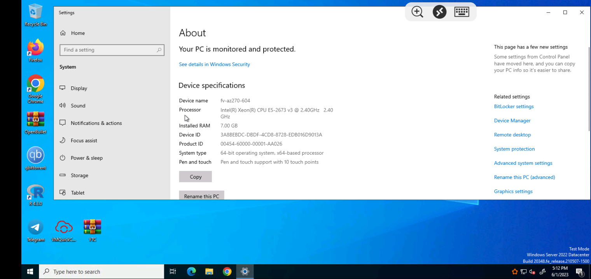

## Disala-Windows-10-RDP-🇱🇰 

# Read This Before Rushing To Actions Tab 💀

• Note : i'm not responsible for suspended accounts
* Note : Set up much as you want but maximum is 10
* Note : Those who have low connection use no sound workflow scripts

### Windows 10 Least

VM features:
- 2-core vCPU
- 7 GB RAM
- 100 GB Disk **(Excluded System Used)**

---

Secrets Name | Uses | Notes
----- | ----- | -----
**NGROK_AUTH_TOKEN_01** | For Host The 001 RDP | Type Different Ngrok Auth Token Than Other 9
**NGROK_AUTH_TOKEN_02** | For Host The 002 RDP | Type Different Ngrok Auth Token Than Other 9
**NGROK_AUTH_TOKEN_03** | For Host The 003 RDP | Type Different Ngrok Auth Token Than Other 9
**NGROK_AUTH_TOKEN_04** | For Host The 004 RDP | Type Different Ngrok Auth Token Than Other 9
**NGROK_AUTH_TOKEN_05** | For Host The 005 RDP | Type Different Ngrok Auth Token Than Other 9
**NGROK_AUTH_TOKEN_06** | For Host The 006 RDP | Type Different Ngrok Auth Token Than Other 9
**NGROK_AUTH_TOKEN_07** | For Host The 007 RDP | Type Different Ngrok Auth Token Than Other 9
**NGROK_AUTH_TOKEN_08** | For Host The 008 RDP | Type Different Ngrok Auth Token Than Other 9
**NGROK_AUTH_TOKEN_09** | For Host The 009 RDP | Type Different Ngrok Auth Token Than Other 9
**NGROK_AUTH_TOKEN_10** | For Host The 010 RDP | Type Different Ngrok Auth Token Than Other 9
---

* We Have Some Cool Features That Other Scripts Dosen't Have
  - Automatically Telegram Installed
  - Automatically Winrar Installed
  - Automatically Open Bullet Installed
  - Automatically VM Quick Config Installed
  - Removed Stupid/Unrated Softwares
  - YT Watchtime Hack Cheat
  - Automatically Qbit Installed 
  - Ect ...

## Deploy and Run

    
Windows 10 RDP Install and Run

 
    
* First Step (Do 2nd Step Before Running Workflow)
    
* Go to [**Here**](https://drive.google.com/drive/folders/121UNlHIqt6WMMWBYmS0KZlyB__zMmVa8) and select [**with sound**](https://drive.google.com/drive/folders/1ATVEOg-WLCV3HAEu8uOWGsGY1vYFdbmr) [**or not**](https://drive.google.com/drive/folders/1AMPfpkrzFIhdRHfc22rxdQW8M4AYKkzO).
    
* After selection, **download all 10 workflow scripts**.
    
* Create new github repo , click **create new file** and copy this text **.github/workflows/test** also type test in empty box and click **committed changes** after that **upload download 10 workflow scripts in there**.
    
* Now go to **Actions** Tab and select one of system workflow.

* Click **Run Workflow** button on the left of **This workflow has a workflow_dispatch event trigger** line.

* Wait until a few minutes.

* Copy the link(**without tcp://**) and go to Remote Desktop, input the link to connect that you copied from the workflow.

* Fill in those login info, within username:**TheDisala** or **runneradmin** and password:**@#Disala123456** .

* Enjoy!

    
Setup Secret Key

 
    
* Second Step
    
* Go to **Settings in repo > Secrets and variables > Actions**.
    
* Click **New repository secret**.
   
* To **Name: NGROK_AUTH_TOKEN** and to **Secret: paste your ngrok auth token [get your token](https://dashboard.ngrok.com/get-started/your-authtoken).

* Now click **Add Secret**.

# [Watch Tutorial If You Dosen't Understand This.](https://youtu.be/P-ctz1CuPi0)

### Brought To You By Disala 💀 , Its Functional 😗.
### You Can See IP , Username , Pass And Cool Ascki Art 
